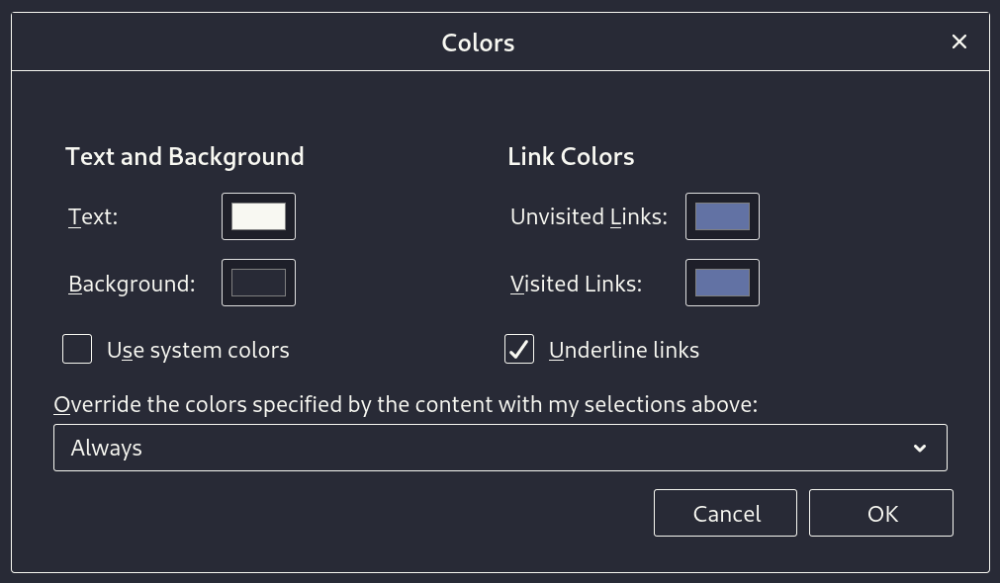

### [Thunderbird](https://www.thunderbird.net/en-US/)

#### Install using Thunderbird Themes (preferential)

Install the theme directly from [Thunderbird Themes](https://addons.thunderbird.net/en-US/thunderbird/addon/dracula-theme-for-thunderbird/).

#### Install manually

1. Download using the [GitHub .zip download](https://github.com/dracula/thunderbird/archive/master.zip) option.
2. Open Thunderbird and go to Tools > Add-ons > Settings (cog wheel) > Install Add-on From File...
3. Select the .zip file that you just downloaded
4. Allow the installation, when Thunderbird asks you.

#### Optional: Tweak the text, background and link colors
1. Open Thunderbird.
2. Go to Edit > Preferences > General > Language & Appearance > Fonts & Colors > Colors…
3. Adjust the colors to your liking.

