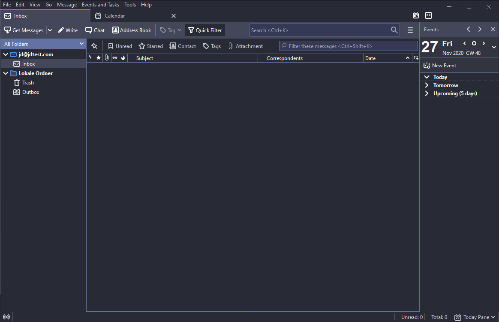
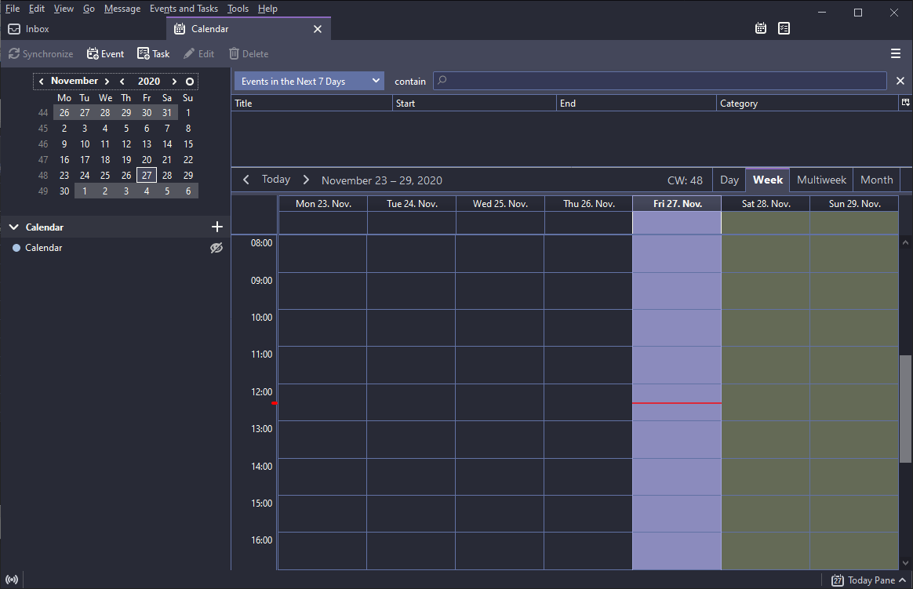

# Dracula for [Thunderbird](https://www.thunderbird.net/en-US/)

> A dark theme for [Thunderbird](https://addons.thunderbird.net/en-US/thunderbird/addon/dracula-theme-for-thunderbird/)

## Install

All instructions can be found at [draculatheme.com/thunderbird](https://draculatheme.com/thunderbird).

## Team

This theme is maintained by the following person(s) and a bunch of [awesome contributors](https://github.com/dracula/thunderbird/graphs/contributors).

|  |
| ---------------------------------------------------------------------------------------------------- |
| [Max Frei](https://github.com/maxfrei750)                                                            |

## Community

- [Twitter](https://twitter.com/draculatheme) - Best for getting updates about themes and new stuff.
- [GitHub](https://github.com/dracula/dracula-theme/discussions) - Best for asking questions and discussing issues.
- [Discord](https://draculatheme.com/discord-invite) - Best for hanging out with the community.

## License

[MIT License](./LICENSE)
